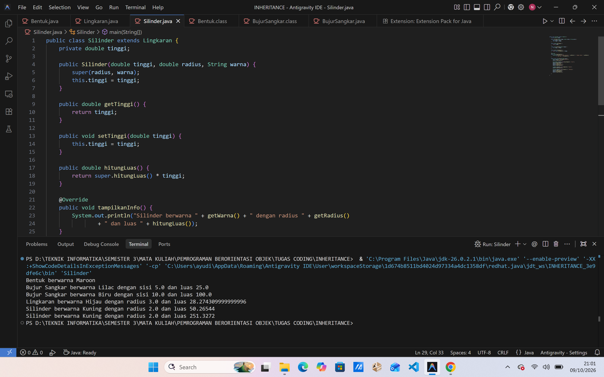

# Inheritance Bentuk Geometri - Java


Program Java sederhana untuk mempelajari **pewarisan (inheritance)** pada OOP. Program ini memodelkan beberapa bentuk geometri (bujursangkar, lingkaran, dan silinder) yang saling mewarisi dari satu kelas induk, yaitu `Bentuk`.

## Daftar Isi
- [Tujuan Pembelajaran](#tujuan-pembelajaran)
- [Struktur Kelas](#struktur-kelas)
- [Rumus yang Dipakai](#rumus-yang-dipakai)
- [Struktur Folder](#struktur-folder)   
- [Cara Menjalankan](#cara-menjalankan)
- [Contoh Penggunaan](#contoh-penggunaan)   
- [Hasil Output](#hasil-output)
- [Konsep OOP](#konsep-oop-yang-dipelajari)
- [Pembuat](#pembuat)

## Tujuan Pembelajaran

- Memahami konsep pewarisan antar kelas
- Menggunakan `super()` untuk memanggil constructor induk
- Menerapkan method overriding dengan `@Override`
- Menerapkan encapsulation lewat getter dan setter

## Struktur Kelas

```
Bentuk
├── BujurSangkar
└── Lingkaran
    └── Silinder
```

| Kelas | Turunan dari | Atribut | Method |
|-------|--------------|---------|--------|
| `Bentuk` | - | `warna` | `getWarna()`, `setWarna()`, `tampilkanInfo()` |
| `BujurSangkar` | `Bentuk` | `sisi` | `getSisi()`, `setSisi()`, `hitungLuas()`, `tampilkanInfo()` |
| `Lingkaran` | `Bentuk` | `radius`, `PHI` (konstanta) | `getRadius()`, `setRadius()`, `hitungLuas()`, `tampilkanInfo()` |
| `Silinder` | `Lingkaran` | `tinggi` | `getTinggi()`, `setTinggi()`, `hitungVolume()`, `tampilkanInfo()` |

## Rumus yang Dipakai

| Bentuk | Rumus |
|--------|-------|
| Luas bujursangkar | `sisi x sisi` |
| Luas lingkaran | `PHI x radius x radius` (PHI = 3.14159) |
| Volume silinder | `luas alas x tinggi` |

## Struktur Folder

```
INHERITANCE/
├── assets/            # screenshot hasil output
│   └── output.png
├── Bentuk.java
├── BujurSangkar.java
├── Lingkaran.java
├── Silinder.java
├── .gitignore
└── Readme.md
```

## Cara Menjalankan

1. Pastikan **JDK** sudah terpasang:

   ```bash
   java -version
   javac -version
   ```

2. Clone repository ini:

   ```bash
   git clone https://github.com/USERNAME/NAMA-REPO.git
   cd NAMA-REPO
   ```

3. Compile semua file, lalu jalankan kelas yang berisi `main`:

   ```bash
   javac *.java
   java NamaKelasYangAdaMain
   ```

   Contoh: kalau method `main` ada di `Bentuk.java`, jalankan `java Bentuk`.

> Bisa juga langsung klik tombol **Run** di VS Code pada file yang berisi `main`.

## Contoh Penggunaan

```java
Bentuk object1 = new Bentuk("Maroon");
object1.tampilkanInfo();

BujurSangkar object2 = new BujurSangkar(5, "Lilac");
object2.tampilkanInfo();
object2.setSisi(10);
object2.setWarna("Biru");
object2.tampilkanInfo();

Lingkaran object3 = new Lingkaran(3, "Hijau");
object3.tampilkanInfo();

Silinder object4 = new Silinder(4, 2, "Kuning");
object4.tampilkanInfo();
object4.setTinggi(20);
object4.tampilkanInfo();
```

## Hasil Output

<p align="center">
  
</p>

## Konsep OOP yang Dipelajari

- **Inheritance**: kelas anak mewarisi atribut dan method kelas induk memakai `extends`.
- **`super(...)`**: memanggil constructor kelas induk.
- **Encapsulation**: atribut dibuat `private` dan diakses lewat getter dan setter.
- **Method overriding**: `tampilkanInfo()` ditulis ulang di tiap kelas anak dengan `@Override`.
- **Konstanta kelas**: `PHI` dibuat dengan `public static final`.

## Pembuat

- **Nama**: Ni Putu Ayu Dian Sulastri
- **NIM**: F1D02510021
- **Mata Kuliah**: Pemrograman Berorientasi Objek